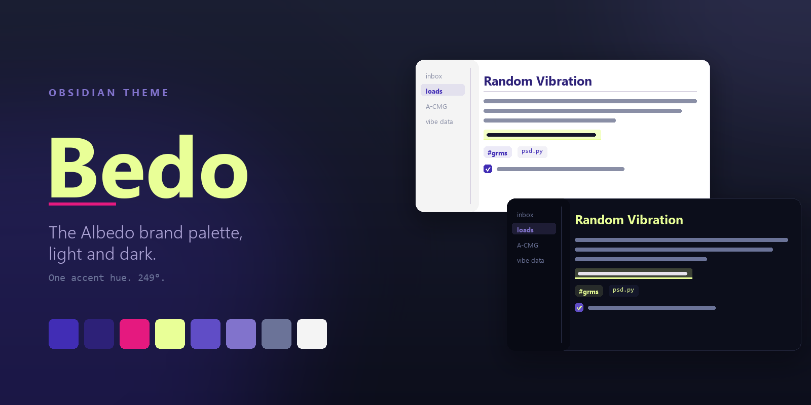
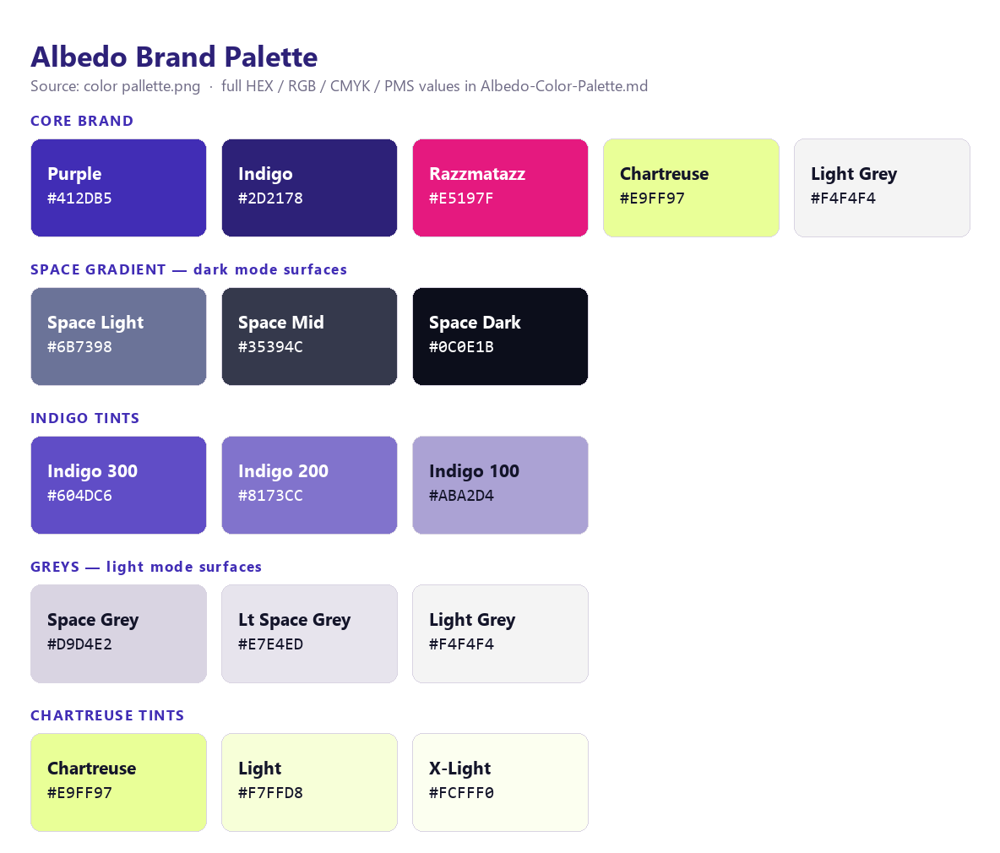

# Bedo

An Obsidian theme in the Albedo brand palette. Light mode uses Light Grey and Space
Grey surfaces with an Albedo Purple accent. Dark mode uses the Space Gradient with an
Indigo 200 accent and Chartreuse highlights.



## Modes

| | Light mode | Dark mode |
|---|---|---|
| Page background | `#FFFFFF` | Space Dark `#0C0E1B` |
| Sidebar background | Light Grey `#F4F4F4` | `#080A14` |
| Accent | Purple `#412DB5` | Indigo 200 `#8173CC` |
| Button fill | Purple `#412DB5` | Purple `#412DB5` |
| H1 | Indigo `#2D2178` | Chartreuse `#E9FF97` |
| Tags | Purple on a purple wash | Chartreuse on a chartreuse wash |
| Highlights | Chartreuse wash and underline | Chartreuse wash and underline |

Both modes share one accent hue (249°). Only saturation and lightness change.

## Install

The theme is already in this vault. Use these steps for a different vault.

1. Copy the `Bedo` folder into `<vault>/.obsidian/themes/`.
2. Start Obsidian.
3. Open **Settings → Appearance**.
4. Select **Bedo** in the **Themes** list.

The app itself loads only `theme.css` and `manifest.json`. It ignores `README.md`,
`screenshot.png`, and the `assets` folder. See **Publishing** for the files that
Obsidian's community gallery reads.

## Live sample

Open this file in Obsidian to see the theme render. Use it to check a change to
`theme.css`. Obsidian hides the `.obsidian` folder from the file explorer, so open the
file from outside the vault, or copy this section into a note.

Body text sits at `#14152A` in light mode and `#E7E4ED` in dark mode. **Bold text is
Razzmatazz.** *Italic text is Indigo.* A ==highlight gets a Chartreuse wash and a solid
underline==. Inline code looks like `grms = 6.06`. Tags look like #vibe and #a-cmg.

> A blockquote is italic and colored. The bar on the left is Indigo 100 in light mode
> and Indigo 300 in dark mode.

```python
# Code blocks get a numbered gutter in live preview.
import numpy as np
grms = np.sqrt(np.trapz(psd, f))
```

- [ ] Open task
- [x] Done task
- [/] In progress
- [>] Forwarded
- [<] Scheduled
- [?] Question
- [!] Important
- [*] Star
- [-] Cancelled
- [i] Info
- [b] Bookmark
- [I] Idea
- [u] Trending up
- [d] Trending down
- [l] Location

## Features

Each feature is on by default.

| Feature | Effect |
|---|---|
| Active line highlight | A tinted background and an accent bar mark the line you edit. |
| Fancy highlights | `==marks==` get a Chartreuse wash and a solid Chartreuse underline. |
| Code block line numbers | Live preview shows a numbered gutter beside code blocks. |
| Image cards | Images get rounded corners and a drop shadow. |
| Hover breadcrumb | The pane header title fades in on hover. |
| Colored emphasis | Bold is Razzmatazz. Italic is Indigo. Blockquotes are colored and italic. |
| H2 underline | A 2 px rule sits under every H2. |
| Alternate task states | 13 extra checkbox glyphs. See the table below. |

### Alternate task states

Type the character inside the checkbox brackets.

| Mark | Meaning | Mark | Meaning |
|---|---|---|---|
| `[/]` | In progress | `[i]` | Info |
| `[>]` | Forwarded | `[b]` | Bookmark |
| `[<]` | Scheduled | `[I]` | Idea |
| `[?]` | Question | `[u]` | Trending up |
| `[!]` | Important | `[d]` | Trending down |
| `[*]` | Star | `[l]` | Location |
| `[-]` | Cancelled | | |

`[-]` and `[x]` fade the text. The other marks keep the normal text color.

## Style Settings

The [Style Settings](https://github.com/mgmeyers/obsidian-style-settings) plugin is
optional. The theme looks the same without it.

1. Install and enable the Style Settings plugin.
2. Open **Settings → Style Settings → Bedo**.

The plugin exposes five groups:

- **Features** — a "Disable ..." toggle for each feature above, plus link underlines.
- **Headings** — H1–H3 colors and sizes, underline options, and small caps.
- **Text and emphasis** — bold, italic, blockquote, and highlight colors. Line width.
- **Code and tags** — code, gutter, and tag colors.
- **Progress bar colors** — five color stops. The ramp is off by default.

To turn a feature off without the plugin, delete its section from `theme.css`. Each
section carries a number and a comment.

## Palette



The swatch sheet above carries every hex value the theme uses. `theme.css` also names
each value in a comment.

`assets/Albedo-Color-Palette.md` holds the full brand table, with RGB, CMYK, and PMS
values, and transcribes `assets/color pallette.png`. Both files are local only. The
public repository excludes them.

The brand sheet has no red, orange, green, or cyan. `theme.css` derives those four
colors from Razzmatazz, Chartreuse, and Space Light. Callouts, tags, and graph nodes
therefore stay in the brand family. Section 2 of `theme.css` marks each derived value.

Two values change per mode for contrast:

- Light mode darkens Chartreuse to `#A8BD3F` for text and graph use.
- Dark mode lightens Razzmatazz to `#F04B9C` for bold text on Space Dark.

## Files

| Path | Purpose |
|---|---|
| `theme.css` | The theme. 21 numbered sections and a Style Settings block. |
| `manifest.json` | Theme name, version, author, and minimum app version. |
| `README.md` | This file. |
| `screenshot.png` | The theme card image for the community gallery. |
| `assets/bedo-cover.png` | The cover image above. |
| `assets/bedo-palette.png` | The swatch sheet above. |
| `assets/palette-swatches.svg` | The swatch sheet as vector. |
| `assets/make-assets.py` | Regenerates the two PNGs. Run `python make-assets.py`. |
| `.gitignore` | Keeps the brand source files below out of the public repository. |

These files stay local. `.gitignore` excludes them.

| Path | Purpose |
|---|---|
| `assets/Albedo-Color-Palette.md` | Brand values in HEX, RGB, CMYK, and PMS. |
| `assets/color pallette.png` | The source brand sheet. |
| `assets/Albedo_Logo_Web_Purple.png` | Logo for light backgrounds. |
| `assets/Albedo_Logo_Web_Black.png` | Logo for light backgrounds. |
| `assets/Albedo_Logo_Web_Chartreuse.png` | Logo for dark backgrounds. |
| `assets/Albedo_Logo_Web_SpaceGrey.png` | Logo for dark backgrounds. |
| `assets/Logo White.png` | Logo for dark backgrounds. |

## Publishing

The theme card in **Settings → Appearance → Themes → Manage** shows an image only when
`manifest.json` holds both a `repo` and a `screenshot` key. Obsidian builds the image
URL as `https://raw.githubusercontent.com/<repo>/HEAD/<screenshot>`. The URL is always
remote. Obsidian never reads a local image file for the theme card.

`manifest.json` holds these two keys already:

```json
"repo": "stepheneshafer/Bedo-Obsidian-Theme",
"screenshot": "screenshot.png"
```

The card image therefore resolves to
`https://raw.githubusercontent.com/stepheneshafer/Bedo-Obsidian-Theme/HEAD/screenshot.png`.
The image appears after two steps:

1. Push this folder to `https://github.com/stepheneshafer/Bedo-Obsidian-Theme`.
2. Restart Obsidian.

The repository must be public. `raw.githubusercontent.com` returns 404 for a private
repository. `HEAD` resolves to the default branch, so `screenshot.png` must sit at the
repository root on that branch.

Obsidian merges the local `manifest.json` over the community gallery entry, so these
two keys work before the theme is listed in the gallery.

The `assets` folder holds Albedo brand source files. `.gitignore` keeps the logo images,
the printed brand sheet, and the CMYK/PMS value table out of the public repository. The
theme itself needs none of them at run time.

The `name` in `manifest.json` must match the folder name exactly, or Obsidian skips the
theme. Both are `Bedo`.

## Credits

Bedo adapts CSS from two themes and recolors it to the Albedo palette:

- [Things](https://github.com/colineckert/obsidian-things) by @colineckert — heading
  rules, fancy highlights, code block gutter, hover breadcrumb, image cards.
- [Minimal](https://github.com/kepano/obsidian-minimal) by @kepano — the alternate
  checkbox states.

Check each repository for its license before you redistribute this theme.

## Version

1.0.0. Requires Obsidian 1.5.0 or later.
